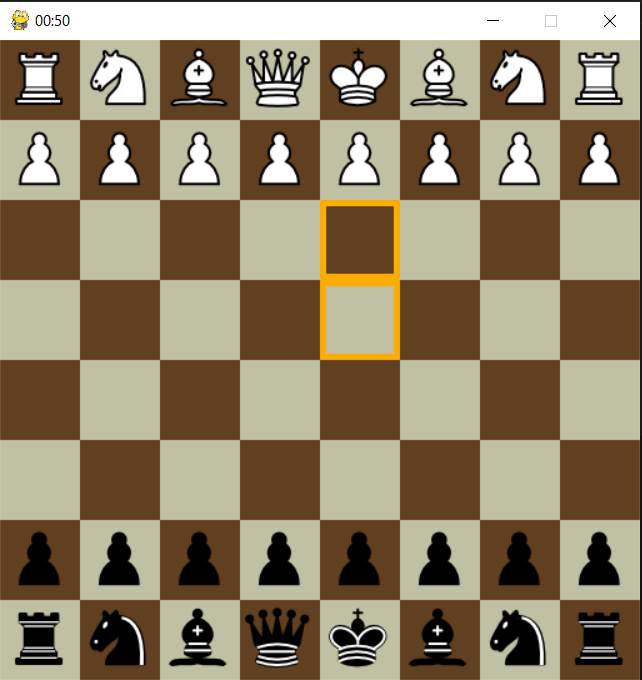
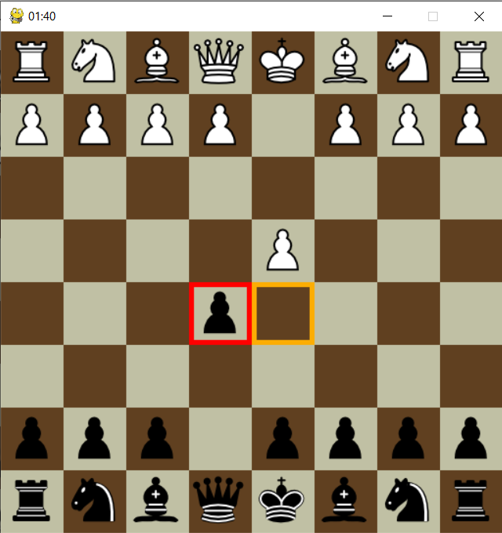
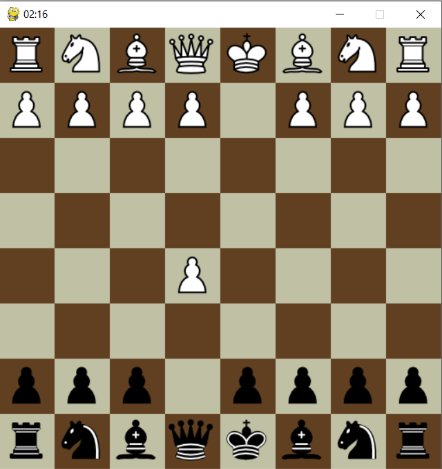
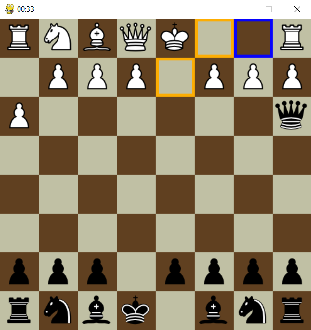
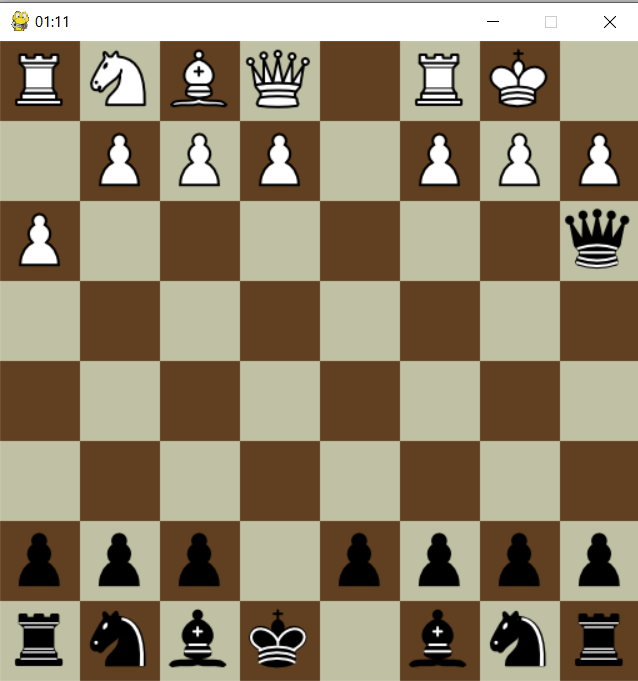
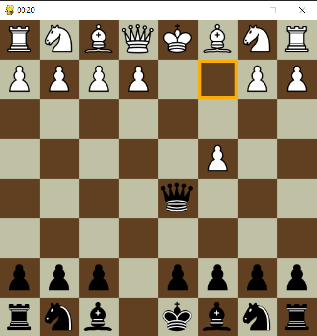
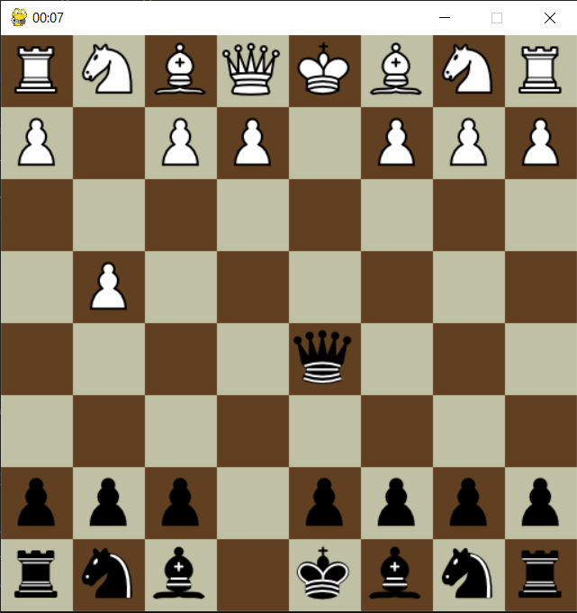

# 										Chess Board

## 						[Mohammad Hossein Basouli](https://github.com/MMDPROJECT), [Mobina Kargar](https://github.com/Grmamobin)


# Chess App Report

## Introduction

This app implements the classic game of chess using **python** and **pygame**

## Installation Guide

Install the package **pygame** using the command ``` pip install pygame ```

## Usage Instructions

1. Navigate through this path: Chess-Board/Shared/Classes/Pieces 
2. Then open the command line and type ``` python start.py ```

## Test Results

- Displaying available moves for each piece: 

  

- Displaying available captures for each piece: 

  

- Capturing:

  

- Displaying available castle moves:

​																				

- Castling:

  

- Check: 

  

- Check-Mate:

  


